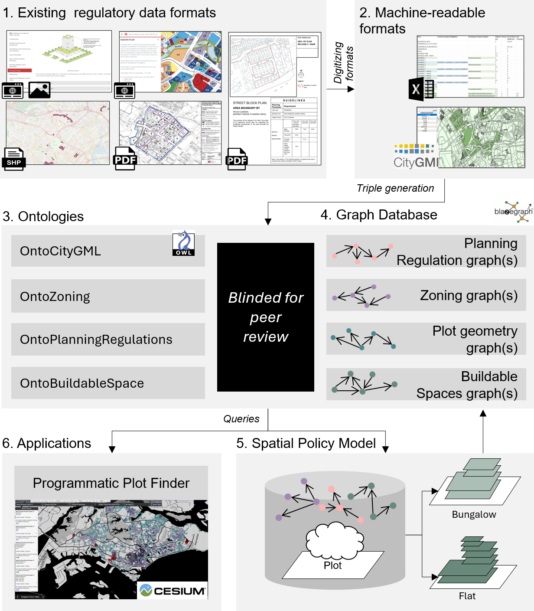

# 3D Land Use Planning

This repository provides a comprehensive framework for modeling and analyzing allowable Gross Floor Area (GFA) under Singapore’s planning regulations using semantic web ontologies such as **OntoPlanningRegulations** and **OntoBuildableSpace**. It integrates data instantiation, regulatory analysis, and visualization in a single environment, supporting 3D land-use planning and insights into allowable GFA based on various zoning policies.

**Key objectives:**

- Parse regulations (both area- and type-based) into a knowledge graph.
- Compute allowable GFA across plots in Singapore.
- Visualize results, including regulations and GFA analytics of buildable spaces.

## Features

1. **Modeling GFA Regulations**  
   Supports area- and type-based regulations, and computes allowable GFA.

2. **Knowledge Graph (KG) Integration**  
   Generates RDF triples for planning regulations and uploads them to a Blazegraph SPARQL endpoint.

3. **Data Analysis and Visualization**  
   Enables regulatory data analysis and visualization of buildable spaces across Singapore.



## Installation

1. **Setup Environment**  
   Ensure you have `Python 3.9` or higher and `conda` is installed.
   Clone the repository and set up the Python environment.

   ```
   git clone <repository-url>
   cd <repository-directory>
   conda env create -f environment.yml
   conda activate gfa_model
    ```

2. **Directory Structure**:
   ```
   ├── main.py                              # CLI for managing sub-processes like data instantiation and analysis
   ├── triple_dataset.py                    # Functions to create RDF triples for planning regulations
   ├── instantiators.py                     # Functions to generate and export triples in N-Quads format, then upload them
   ├── retrievers.py                        # Functions to query and process regulations, and plot data from the KG
   ├── utils.py                             # Utility functions for preprocessing and supporting other scripts
   ├── analysis.py                          # Functions to analyze data and generate visualizations
   ├── GFAOntoManager.py                    # Schema manager for ontologies related to zoning and planning
   └── data_submission/                     # Contains intermediate input or generated output data
      ├── input/                            # intermediate data necessary for full workflow reproducibility
         ├── area_regulation_geometry/      # Contains geometries of area-based subset of planning regulations
         ├── output_onto_zoning_plots.nq    # Singapore’s 2019 Masterplan zoning data in RDF format
         ├── plots.nq                       # Singapore’s plot data in RDF format
         ├── development_control_plans.xlsx # Digitized development control plan regulations (from URA website)
         ├── road_network/                  # Contains Singapore’s road network Shaprefile
      ├── output/                           # All generated data from this workflow is stored here
         ├── analysis/                      # Contains output tabular data and plots for the 3D landuse paper
         ├── scenarios/                     # N-quads generated if scenario=true
      
    ```
- data_submission/input/: Contains the essential input files (e.g., planning regulation geometries, Masterplan plot data [[4]](#references), road network [[5]](#references), etc.).
- data_submission/output/: Stores generated data such as processed RDF outputs, figures, and tables relevant for the 3d landuse planning paper.

## Data and Reproducibility:

   - Intermediate input data specific to this workflow can be [downloaded](https://doi.org/10.5281/zenodo.14590537) and should be placed in the `data_submission/input/` folder to match the directory structure above.
   - Some of the intermediate data was generated using [The World Avatar](https://github.com/cambridge-cares/TheWorldAvatar) infrastructure as part of the [Cities Knowledge Graph (CKG)](https://github.com/cambridge-cares/CitiesKG) project, with its creation documented in other sources [[1,2,3]](#references). Reproducing this data requires a comprehensive setup and close coordination with researchers from both projects.
   - The full workflow has been tested on Windows operating system, Lenovo ThinkPad X1 (12th Gen Intel(R) Core(TM) i7-1260P 2.10 GHz) and may take several hours.

## Knowledge Graph Setup:

**Install Blazegraph**:
- Ensure `Java 8+` is installed.
- [Download](https://github.com/blazegraph/database/releases/tag/BLAZEGRAPH_2_1_6_RC) `blazegraph.jar` and place it in the root directory.
- Start Blazegraph by navigating to the root directory and running the following in CLI:
  ```
  java -server -Xmx16g -jar blazegraph.jar
  ```
   
 Then open the running local Blazegraph instance URL in a browser window, e.g., `http://127.0.0.1:9999/blazegraph/`. 
 The Blazegraph UI have several tabs (e.g., QUERY, UPDATE, NAMESPACE, etc.) that can be used to interact with the KG in a UI. For details refer to official [Blazegraph Wiki](https://github.com/blazegraph/database/wiki) 
 
 **IMPORTANT**: to set up the blazegraph for full reproducibility of the semantic regulatory dataset and allowable GFAs dataset, follow the **Full Workflow** instructions section. This process involves several steps and took approximately 4 hours to complete on the test machine.
 To set up blazegraph for 3D landuse paper reproducibility, follow the  **Paper Results Reproducibility Workflow** instructions section. 

## Full Workflow:

The workflow consists of subprocesses executed via `main.py`. Follow these steps to reproduce the generation of regulatory and allowable GFA datasets:

1. **Setup Blazegraph Namespaces:** 
   ```
   python main.py setup-blazegraph
   ```
   In the Blazegraph UI ensure the Blazegraph namespace structure matches the following:
   ```
   ├── plots                       # Plot geometry n-quads
   ├── regulations                 # Planning-regulation-related n-quods
   ├── regulations_height_change   # Planning-regulation-related n-quods (if scenario=true in the config.ini)
   ├── height_control_plan_geom    # Height Control Plan geometry n-quads
   ├── planning_boundary_geom      # Planning Boundaries geometry n-quads
   ├── urban_design_areas_geom     # Urban Design Areas geometry n-quads
   ├── urban_design_guideline_geom # Urban Design Guidelines geometry n-quads
   ├── street_block_plan_geom      # Street Block Plan geometry n-quads
   ├── monuments_geom              # Monuments geometry n-quads
   ├── landed_housing_areas_geom   # Landed Housing Areas geometry n-quads
   ├── conservation_areas_geom     # Conservation Areas geometry n-quads
   ├── central_area_geom           # Central Area geometry n-quads
   ```

2. **Instantiate Area-Based Regulations**:
    Run the following to generate area-based planning regulations and its links to plots across Singapore and store it in the KG.
    ```
    python main.py instantiate-area-regulations
    ```

3. **Enrich Plot Data**:
    Run the following to generate additional plot property n-quads for plots across Singapore and store it in the KG. This step is relevant for generation of type-based regulations and should not be skipped. 
    ```
    python main.py enrich-plot-data
    ```

4. **Instantiate Type-Based Regulations**:
    Run the following to generate n-quads for type-based planning regulations and its links to plots across Singapore and store it in the KG.
    ```
    python main.py instantiate-type-regulations
    ```

5. **Estimate Allowable GFA**:
   Run the following to generate allowable GFA n-quads for plots across Singapore and store it in the KG.
    ```
    python main.py estimate-allowable-gfas
    ```

6. **Optional** - Height Control Plan change scenario:
   Set `scenario=true` in the `config.ini` file and run the following to generate allowable GFA n-quads for a specific scenario.
    ```
    python main.py estimate-allowable-gfas
    ```

7. **Perform Regulatory Analysis**:
    Run the following to generate figures and tables for the 3D landuse planning paper.
    ```
    python main.py perform-regulatory-analysis
    ```

## Paper Results Reproducibility Workflow:

The workflow consists of subprocesses executed via `main.py`. Follow these steps to reproduce the 3D landuse planning paper tables and figures.
-  In addition to the input data upload, [download](https://doi.org/10.5281/zenodo.14646814) the output data generated by the full workflow and place it in the `data_submission/output/` folder.

1. **Setup Blazegraph Namespaces:** 
   ```
   python main.py setup-reproducibility-blazegraph
   ```

   In the Blazegraph UI ensure the Blazegraph namespace structure matches the following:
   ```
   ├── plots                      # Plot geometry n-quads 
   ├── regulations                # Planning-regulation-related n-quods
   ├── regulations_height_change  # Planning-regulation-related n-quods for a height control change scenario
   ```

2. **Perform Regulatory Analysis**:
   ```
   python main.py perform-regulatory-analysis
   ```

## Tips and Troubleshooting:

- Ensure Blazegraph namespaces match those specified in the configuration. For the input files, do not change names.
- We provide example queries [here](https://polybox.ethz.ch/index.php/s/MHUMJcJ8YFGOLJX) that can be used to test and explore the uploaded data. 
- For namespace-specific issues, consult the Blazegraph wiki or ensure proper SPARQL endpoint connectivity.


## Acknowledgements:

This work is part of the Cities Knowledge Graph (CKG) project, an Intra-CREATE collaborative project involving CARES (Cambridge Centre for Advanced Research and Education in Singapore), which is University of Cambridge’s presence in Singapore, and the Singapore-ETH Centre, which was established collaboratively between ETH Zurich and the National Research Foundation Singapore. We acknowledge contributions of the CKG team, in particular Shiying Li, Arkadiusz Chadzynski, Heidi Silvennoinen, Chenyi Cai, and Markus Kraft. The authors express their sincere gratitude to the officers of Singapore's Urban Redevelopment Authority and Smart Nation Singapore for providing valuable feedback and support.

## References:

[1]: Silvennoinen, H., Chadzynski, A., Farazi, F., Grišiūtė, A., Shi, Z., von Richthofen, A., Cairns, S., Kraft, M., Raubal, M., & Herthogs, P. (2023). A semantic web approach to land use regulations in urban planning: The OntoZoning ontology of zones, land uses and programmes for Singapore. Journal of Urban Management. https://doi.org/10.1016/j.jum.2023.02.002

[2]: Grisiute, A., Silvennoinen, H., Li, S., Chadzynski, A., Raubal, M., Kraft, M., Von Richthofen, A., & Herthogs, P. (2023). A Semantic Spatial Policy Model to Automatically Calculate Allowable Gross Floor Areas in Singapore. In M. Turrin, C. Andriotis, & A. Rafiee (Eds.), Computer-Aided Architectural Design. INTERCONNECTIONS: Co-computing Beyond Boundaries (Vol. 1819, pp. 455–469). Springer Nature Switzerland. https://doi.org/10.1007/978-3-031-37189-9_30

[3]: Chadzynski, A., Krdzavac, N., Farazi, F., Lim, M. Q., Li, S., Grisiute, A., Herthogs, P., von Richthofen, A., Cairns, S., & Kraft, M. (2021). Semantic 3D City Database—An enabler for a dynamic geospatial knowledge graph. Energy and AI, 6. https://doi.org/10/gmfgm3

[4]: Urban Redevelopment Authority. (2019). Master Plan 2019 Land Use layer (2024) [Dataset]. data.gov.sg. Retrieved from https://data.gov.sg/datasets/d_90d86daa5bfaa371668b84fa5f01424f/view

[5]: Urban Redevelopment Authority. (2020). Road Network (2024) [Dataset]. data.gov.sg. Retrieved January 1, 2025 from https://data.gov.sg/datasets/d_717cd51c67db03f2d9c7c18c89c32df1/view
